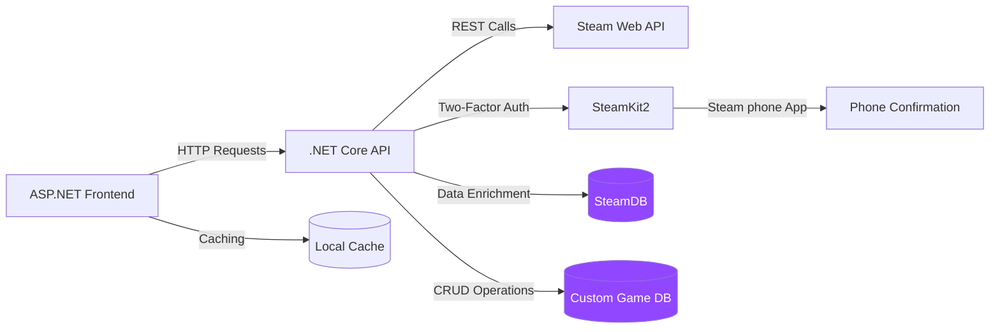

<p align="center">
  <a href="https://github.com/yourusername/sigmastats" target="_blank">

  </a>
</p>

<p align="center">
  <a href="https://dotnet.microsoft.com/">
    
  </a>
  <a href="https://dotnet.microsoft.com/apps/aspnet">
    
  </a>
  <a href="https://developer.valvesoftware.com/wiki/Steam_Web_API">
    
  </a>
  <a href="https://github.com/SteamRE/SteamKit">
    
  </a>
  <a href="https://restfulapi.net/">
    
  </a>
  <a href="https://opensource.org/licenses/MIT">
    
  </a>
</p>

# SigmaStats - Steam Game Analytics

A responsive web application for deep analysis of Steam game statistics using official Steam APIs and community tools.

## 🎮 Core Functionality

### 1. Steam Games Data Integration

https://github.com/user-attachments/assets/3dccd34b-920a-4480-b5fe-5e05645bd4e5

- **Comprehensive Game Data**:
  - Retrieve game metadata from Steam Web API
  - Fetch playtime statistics and achievements
  - SteamID resolution and profile parsing
- **Data Processing**:
  - SteamKit2 for authentication (2FA support)
  - SteamDB integration for extended metadata
  - Automatic data refresh scheduling

### 2. User Games Management

https://github.com/user-attachments/assets/2062f0e5-f6de-4086-ba37-99bf51bbe31a

- **Custom Game Tracking**:
  - User-specific game collections
  - Playtime tracking from Steam data
  - Personal ratings system

### 3. Custom Database CRUD

https://github.com/user-attachments/assets/ce792229-f8c4-46c6-ada1-9f5179146b6e

- **Full Data Control**:
  - Create: Add custom game entries
  - Read: Reading data from DB
  - Update: Modify every data you need
  - Delete: Cleanup what you need

## 🛠️ Technical Implementation


## 🛠️ Technical Stack

### Backend Services
- **ASP.NET Core Web API**
  - RESTful endpoints with JWT authentication
  - Custom action filters for request validation
- **Steam Integration**
  - Steam Web API
  - SteamKit2 for:
    - Two-factor authentication (Steam Guard)
    - Session management

### Frontend Application
- **ASP.NET Core MVC**
  - Razor Pages with ViewComponents
  - Model binding with custom validators
- **Data Visualization**
  - Chart.js for:
    - Playtime trend graphs
    - Achievement progress charts
- **UI Framework**
  - Bootstrap with:
    - Custom Steam-inspired theme
    - Responsive grid layouts

### Development Prerequisites
- **Tools**
  - .NET SDK
  - Visual Studio 2022 (with ASP.NET workload)
  - SQL Server Management Studio
- **Accounts**
  - Steam Developer API Key
  - Steam account with 2FA enabled
- **Configuration**
  - `appsettings.json` requirements:
    ```json
    {
      "Logging": {
        "LogLevel": {
          "Default": "Information",
          "Microsoft.AspNetCore": "Warning"
        }
      },
      "ConnectionStrings": {
        "SteamContext": "your_path_DB"
      },
      "AllowedHosts": "*",
      "SteamApiKey": "your_steam_api_key"
    }

    ```

## 💻 Installation

### Prerequisites
- .NET SDK
- Steam Developer API Key
- SQL Server (or your DB engine)

```bash
git clone https://github.com/ArtemSheliekhov/aspnet-course-project.git
cd aspnet-course-project
dotnet restore

# Configure appsettings.json with:
# - Steam API keys
# - Database connection strings

dotnet run
```

## 🤝 Contributing

Pull requests are welcome. For major changes, please open an issue first to discuss what you would like to change.

## 📜 License

[MIT](https://choosealicense.com/licenses/mit/)


